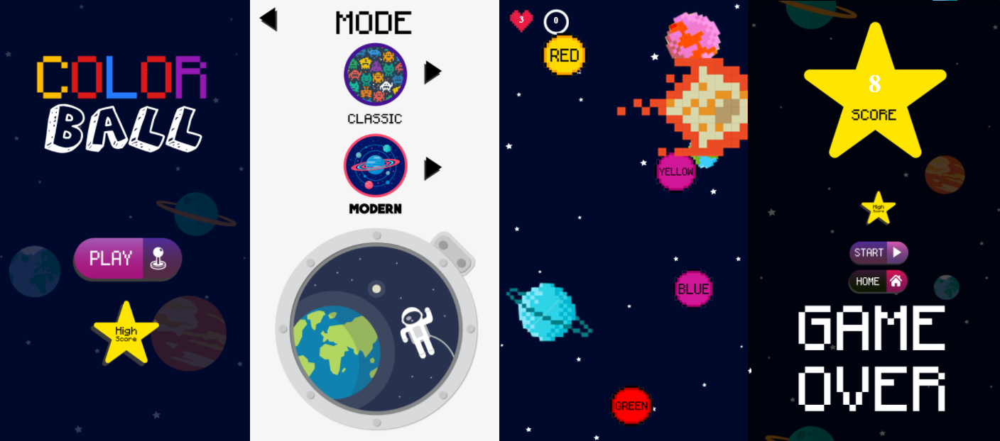

# color_ball
#### To play access: https://naicaparelli.github.io/color_ball/

&nbsp;

# **How to play:**
- Destroy the balls that don't match the name inside with the ball's collor.
- The E.T clean the screen exploding all the ball and gives you +20 on your score.
- The Meteor makes you lose scores.

&nbsp;

# Tools used:
#### **Software:** Construct 2 - https://www.construct.net/en/construct-2/download (STABLE r280 The final Construct 2 release 1 Jul, 2021)
#### **Plugin:** Local Leaderboard by 0plus1 - https://github.com/0plus1/C2_LL

&nbsp;

# Credits and Arts:
#### **Musics:** Credit to the owners
#### **Images at Freepik** - https://br.freepik.com

&nbsp;

# Game prints: 

